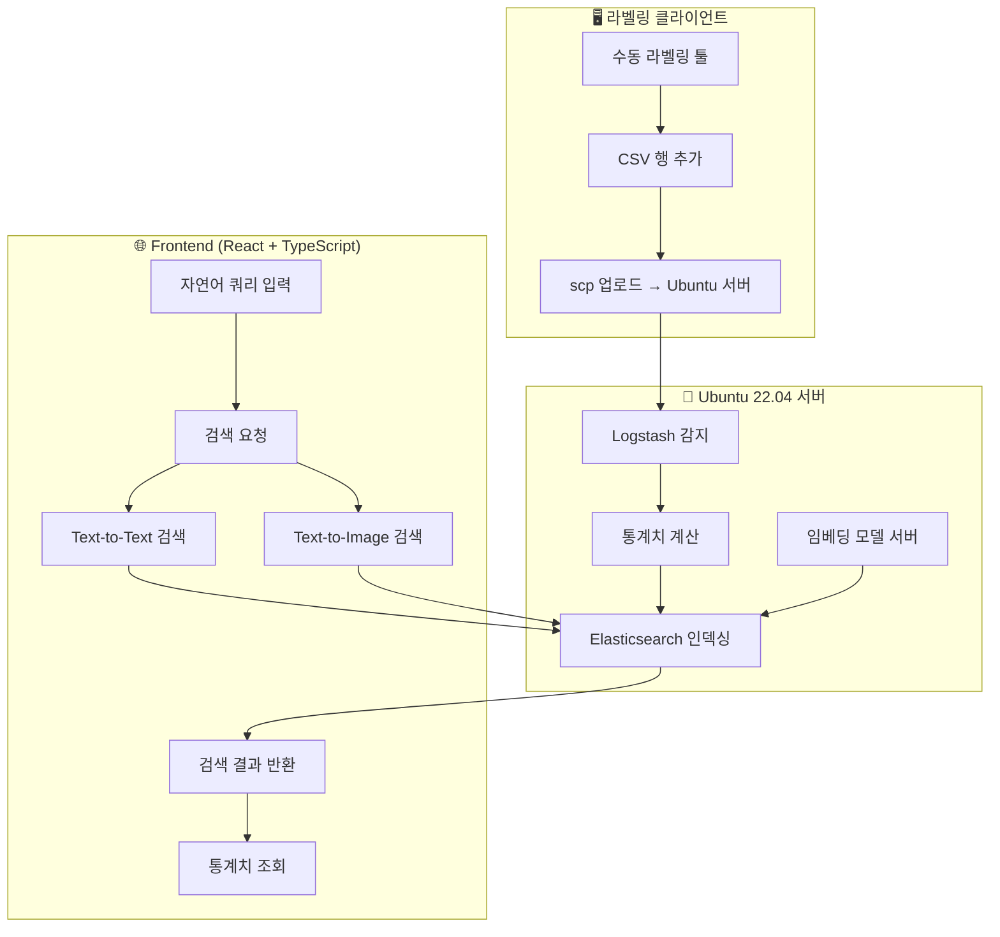

## 📋 프로젝트 개요 (Executive Summary)

### 🎯 핵심 문제
대한민국 제조업은 **인구절벽으로 인한 숙련 기술자 부족**과 **로봇 자동화 확산**이라는 두 가지 거대한 변화에 직면해 있습니다. 하지만 로봇 시스템에서 문제가 발생했을 때, 엔지니어들은 **수천 개의 영상과 센서 로그를 수동으로 뒤져가며 원인을 찾아야 하는 비효율적 상황**에 놓여 있습니다.

### 💡 우리의 해결책
**"자연어 질문 하나로 관련된 로봇 행동을 즉시 찾아주는 AI 검색 시스템"**

- **입력**: "그리퍼가 물체를 놓치는 상황"
- **출력**: 관련 영상 Top 5 + 센서 데이터 분석 + 문제 패턴 진단

### 🚀 핵심 기술적 혁신
1. **하이브리드 임베딩 전략**: 속도(Recall)와 정확도(Precision)를 동시에 만족
2. **멀티모달 융합**: 텍스트-영상 데이터의 통합 검색
3. **도메인 특화 특성 공학**: 로봇 센서 기반 파생 변수 생성

### 📊 기대 지표
- **탐색 시간**: 수일 → **2분 이내**
- **검색 정확도**: R@5에서 **85% 이상**
- **처리 용량**: 시간당 **1,000개 센서 로그** 자동 분석

---

## 📖 프로젝트 스토리라인

### 🎯 시작점: Full Text 검색의 필요성
처음 이 프로젝트는 **"효과적인 Full Text 검색 시스템"**을 구축하는 것에서 출발했습니다. 하지만 단순히 검색 시스템을 만드는 것이 아니라, **"어떤 도메인의 데이터를 검색할 것인가?"**라는 더 근본적인 질문에 직면했습니다.

### 🏭 왜 로봇 데이터인가?
대한민국은 세계적인 **제조업 강국**입니다. 하지만 동시에 심각한 **인구 절벽 문제**에 직면해 있습니다. 

- 통계청 자료에 따르면, 2025년 이후 생산가능인구는 급격히 감소할 예정
- 제조업 현장에서 **숙련된 기술자 부족** 현상이 고조될 것으로 예상됨
- 따라서 **로봇 자동화**는 선택이 아닌 필수가 되고 있음

이러한 배경에서 로봇 기술의 발전과 품질 개선은 국가 경쟁력과 직결되는 중요한 과제입니다. 특히 로봇이 복잡한 작업을 수행할 때 발생하는 **방대한 센서 데이터와 영상 정보를 효율적으로 분석하고 검색**할 수 있는 시스템이 필요하다고 판단했습니다.

### 🎪 최종 목표의 진화
- **초기 목표**: Full Text 검색 시스템 구축
- **중간 목표**: 로봇 데이터를 활용한 LMM(Large Multimodal Model) 검색
- **최종 목표**: **로봇 데이터 검색 에이전트** - 텍스트, 영상, 센서 데이터를 통합 검색할 수 있는 멀티모달 시스템

---

## 🤖 로봇 데이터란 무엇인가?

### 📊 DROID Dataset 1.0.1 소개
이 프로젝트에서 사용한 데이터는 **DROID (Distributed Robot Interaction Object Dataset) 1.0.1**입니다.


### 🔍 로봇 데이터의 구성 요소

#### 1. **센서 로그 데이터**
로봇이 작업을 수행하는 동안 실시간으로 수집되는 수치 데이터입니다:

- **관절 위치 (Joint Position)**: 로봇 팔의 각 관절 각도 정보
  - 예: `joint_position_col0` ~ `joint_position_col5` (6개 관절)
- **카테시안 좌표 (Cartesian Position)**: 로봇 끝단(End-effector)의 3차원 위치
  - 예: `cartesian_position_col0` (X축), `col1` (Y축), `col2` (Z축)
- **속도 정보 (Velocity)**: 위치 변화율
  - `cartesian_velocity_col0` ~ `col5`, `joint_velocity_col0` ~ `col5`
- **그리퍼 정보**: 물체를 잡는 로봇 손의 상태
  - `gripper_position`, `gripper_velocity`

#### 2. **영상 데이터**
로봇의 작업 과정을 기록한 비디오 파일:
- 다양한 각도의 카메라에서 촬영
- 로봇의 물체 조작, 이동 경로 등을 시각적으로 확인 가능
- 센서 데이터와 시간 동기화되어 있음

#### 3. **메타데이터**
작업 환경, 목표, 사용된 물체 등의 설명 정보

### 💡 로봇 데이터를 이해하기 위한 비유
일반인도 쉽게 이해할 수 있도록 비유해보겠습니다:

**로봇 데이터 = 운전자의 주행 기록**
- **센서 로그**: 속도계, RPM, 연료량, 브레이크 압력 등의 계기판 수치
- **영상 데이터**: 블랙박스 영상 (앞/뒤/옆면 카메라)
- **메타데이터**: 목적지, 날씨, 교통 상황 등

운전자가 문제를 진단할 때 "브레이크를 밟았는데 속도가 안 줄어들었나?"를 확인하듯이, 로봇 엔지니어도 "로봇이 물체를 잡으려고 했는데 왜 실패했나?"를 센서 데이터와 영상을 함께 분석해서 찾아냅니다.

---

## 🎯 문제 정의: 왜 검색 시스템이 필요한가?


#### 1. **데이터 규모의 압도적 크기**
- DROID 데이터셋만 해도 **수만 개의 영상과 센서 로그**
  - 
- 각 영상은 수십 초에서 수 분 분량
- 센서 데이터는 **한 작업 영상당 수백 ~수천 개의 데이터 포인트**

#### 2. **수동 탐색의 비효율성**
```
1. 문제 발생 → 2. 비슷한 상황의 과거 데이터 찾기 위해 수백 개 영상 확인 
→ 3. 해당하는 센서 로그 파일 열어서 수치 분석 → 4. 원인 추정 → 5. 해결책 적용
```
우리 에이전트가 없다면? : **하루에서 며칠**이 걸리는 반복적이고 비효율적인 작업입니다.

#### 3.문제 색출 어려움**
- **문제**: 모터 고장, 센서 오작동, 기계적 마모 등

센서 데이터의 패턴을 보면 구분할 수 있지만, 수동으로는 시간이 너무 오래 걸립니다.

### 🚀 우리의 해결책: AI 기반 검색 에이전트
**"자연어로 질문하면 관련된 로봇 영상과 센서 데이터를 자동으로 찾아주는 시스템"**

예시:
- 사용자: *"그리퍼가 물체를 놓치는 상황을 보여줘"*
- 시스템: 관련 영상 5개 + 각 영상의 센서 데이터 통계 + 문제 패턴 분석 결과

---

## 🔬 데이터 분석 과정: 검색 에이전트로 발전해나가는 과정

### 📊 Phase 1: 초기 데이터 탐색

#### 문제점 발견
DROID 데이터셋을 처음 분석했을 때 마주한 현실:
- **연구소별 데이터 품질 편차**: 어떤 데이터는 컬럼이 200개, 어떤 것은 400개
- **결측값 (NaN) 문제**: 센서 오작동으로 인한 빈 데이터
- **메타데이터 부실**: 일부 메타데이터는 "Do anything"과 같은  설명뿐, 구체적인 행동 구분 없음
  - 

- **최소 프레임 문제**: 너무 짧은 영상으로는 의미 있는 패턴 추출 불가

#### 해결 과정
1. **품질 좋은 연구소 데이터 선별 그 중에서도 프레임이 극단적으로 짧거나 극단적으로 긴 프레임들 제거**
2. **고정된 스키마 구축**: 모든 데이터를 일관된 형식으로 변환
3. **행동 단위 라벨 생성**: 모호한 메타데이터는 사용하지 않고 사전에 생성한 비디오 전체 행동 캡션을 사용

### 📊 Phase 2: 통계적 분석 - 요인분석 (Factor Analysis)

**🤔 왜 요인분석을 선택했나?**

300개가 넘는 센서 변수 → 어떻게 의미있게 줄일 것인가?

#### 기술 선택의 논리적 근거
```
문제: 고차원 센서 데이터 (300+ 컬럼)
↓
선택지 분석:
1. PCA (주성분 분석) ❌
   - 해석이 어려움 (성분이 원본 변수의 선형결합)
   - 물리적 의미를 잃어버림

2. 클러스터링 ❌  
   - 변수 간 관계가 아닌 샘플 간 관계에 초점
   - 차원 축소가 주목적이 아님

3. 요인분석 ✅
   - 잠재 요인(로봇 행동의 본질)을 발견 가능
   - 각 요인이 물리적으로 해석 가능
   - 로봇공학의 자유도 개념과 일치
```

**결정 근거**: 로봇의 움직임은 본질적으로 **위치, 속도, 가속도**라는 물리적 개념으로 구성되므로, 이를 잘 설명하는 **잠재 요인을 찾는 것**이 가장 적합하다고 판단

#### 전처리 과정
1. **변동성이 거의 없는 변수 제거**
   ```python
   # 예시: 표준편차가 0.01 이하인 컬럼들
   low_variance_cols = df.columns[df.std() < 0.01]
   ```

2. **강한 상관관계 변수 제거**
   - X, Y, Z 축 데이터는 당연히 상관관계가 강함
   - action(목표값)과 observation(실제값)도 높은 상관관계
   - 하지만 이들의 **차이(오차)**는 중요한 정보

#### 요인분석 적합성 검증


- **Bartlett 구형성 검정**: p < 0.001 ✅ (변수 간 상관관계 유의미)
- **KMO 측도**: 0.632 ⚠️ (경계선 수준이지만 분석 가능)

#### 요인 수 결정


**결과**: 300개 변수 → **10~20개 요인으로 축약 가능**

#### 요인별 해석


- **Factor 1**: 위치·자세 요인 (Cartesian/Joint Position + Gripper)
- **Factor 2**: 특정 축 속도 요인 (cartesian_velocity_col3 중심)  
- **Factor 3**: 보조 위치 요인 (특정 관절/축의 위치 변화)
- **Factor 4**: 다축 속도 요인 (여러 축의 동적 패턴)

### 🏷️ Phase 3: 수동 라벨링 시스템 구축

기존 메타데이터가 불충분해서 **직접 라벨링 도구**를 제작:


**생성된 라벨 카테고리**:
- `"대기"`: 로봇이 다음 명령을 기다리는 상태
- `"접근"`: 목표 물체에 다가가는 상태  
- `"파지"`: 물체를 잡는 동작
- `"운반"`: 물체를 이동시키는 상태
- `"내려놓기"`: 물체를 놓는 동작
- `"정렬"`: 물체 위치를 미세 조정


### 🔍 Phase 4: 라벨 검증 

라벨링 결과를 센서 데이터와 비교했을 때 발견한 문제점:


**문제점**:
- 센서 패턴은 **연속적이고 점진적**으로 변화
- 라벨은 **특정 시점에서 급격히 변화**
- 같은 동작이라도 환경에 따라 **센서 패턴이 크게 달라짐**
- **경계가 모호**하여 일관된 분류 기준 확립이 어려움

**결론**: 단순한 분류 모델로는 한계가 명확함을 확인

---

## 🧪 시도한 접근법들: 한계에서 배운 교훈

### 1: XGBoost를 이용한 센서 분류

**🤔 왜 XGBoost를 선택했나?**
- **가정** : 만약 머신러닝 모델에 센서데이터를 넣었을때 특정 라벨에대한 예측이 가능하다면 구간에 대한 예측또한 가능할것, 구간 검색에 도움을 준다고 판단
#### 기술 선택의 논리적 근거
```
상황 분석:
- 고차원 특성 데이터 (통계량 기반) Feature Importance 를 파악해야만 최종적으로 추후 사용모델에 입력 차원을 정할수 있고 모델의 복잡도를 줄일수 있다고 판단
- 클래스 불균형 문제 존재

모델 선택 고려사항:
1. 신경망 ❌: 데이터 양 대비 과적합 위험, 해석성 부족
2. SVM ❌: 고차원에서 계산 비용 높음, 하이퍼파라미터 민감
3. Random Forest ⚠️: 좋은 선택이지만 Feature Importance 품질이 XGBoost보다 낮음
4. XGBoost ✅:
   - 트리 기반으로 비선형 패턴 잘 포착
   - 클래스 불균형에 강건 (scale_pos_weight 지원)
   - Feature Importance로 중요 센서 식별 가능
   - 정규화 기능으로 과적합 방지
```

**핵심 기대**: 단순 분류 성능보다는 **"어떤 센서가 행동 구분에 중요한가?"**를 파악하여 향후 검색 시스템 설계에 활용


#### 결과와 한계
- **장점**: Feature Importance로 중요 변수 식별 가능
- **단점**:
  - 과적합, 새로운 패턴의 행동, 새로운 도메인에서 견고하지않음
  - 라벨 경계 모호성으로 정확도 불안정
  - 도메인 간 일반화 성능 부족
  - 클래스 불균형 문제

### 2: LSTM + Attention을 이용한 시퀀스 분류

**🤔 왜 LSTM + Attention을 선택했나?**

#### XGBoost의 한계 분석 후 대안 모색
```
XGBoost의 문제점:
- 구간별 집계로 인한 시간적 정보 손실
- 행동 전환 순간의 세밀한 패턴 포착 불가

새로운 접근 필요성:
- 센서 데이터의 본질 = 시계열 (Time-series)
- 행동 경계를 찾으려면 시간적 의존성 학습 필수

모델 선택 근거:
1. Vanilla RNN ❌: 장기 의존성 문제 (vanishing gradient)
2. CNN 1D ❌: 국소적 패턴만 포착, 장거리 의존성 약함
3. Transformer ❌:  계산 비용 높음
4. LSTM + Attention ✅:
   - LSTM: 시간적 순서와 장기 의존성 학습
   - Attention: 행동 전환에 중요한 타임스텝에 집중
   - 해석 가능성: Attention 가중치로 중요 구간 시각화
```

**핵심 가설**: "행동 전환 순간에는 특정 센서들의 패턴이 급변할 것이며, Attention이 이를 포착할 수 있을 것"
```python
class SensorLSTMAttnClassifier(nn.Module):
    def __init__(self, input_dim, hidden_dim, num_classes):
        self.lstm = nn.LSTM(input_dim, hidden_dim, batch_first=True)
        self.attention = AttentionPooling(hidden_dim)
        self.classifier = nn.Linear(hidden_dim, num_classes)
```

#### 결과와 한계


- **전체 정확도**: ~50%
- **일부 클래스 F1**: 0.7 (양호)
- **문제 클래스 F1**: 0.2 ("정렬" 등)

**근본 원인**: 센서 데이터만으로는 **행동 전환 경계**를 명확히 포착하기 어려움, 상황별로 같은 카테고리의 동작이어도 축의 변동이 다른 패턴을 가짐.

### 3: VideoMAE를 이용한 영상 분류

#### 접근 방법
사전 훈련된 VideoMAE 모델을 로봇 영상 데이터에 파인튜닝:
```python
# 16프레임 클립 단위로 영상 분할
# 중앙 프레임의 라벨을 클립 전체 라벨로 사용
# AdamW + CrossEntropyLoss로 학습
```

#### 결과와 한계


- **테스트 정확도**: 37.5~50%
- **주요 문제**: 
  - 조명, 시점, 해상도 등 환경 요인에 과도하게 민감
  - 도메인 간 일반화 실패
  - 클래스 불균형 ("대기", "이동"에 치우침)

### 4: Gemma3를 이용한 비디오 캡셔닝

#### 접근 방법
```python
# 비디오 → 프레임 추출 → Gemma3 캡셔닝 → 텍스트 임베딩
# 멀티모달 LLM으로 영상 내용을 자연어로 변환
```

#### 결과와 한계
- **4~5분 후 시스템 프리징 발생**
- **GPU 메모리 부족**으로 실행 불가
- 로컬 환경의 자원 한계 확인

---

## 🔄 방향 전환: 분류에서 검색으로

### 💡 핵심 인사이트: 왜 검색 패러다임인가?

#### 4번의 과정에서 얻은 공통 교훈
```
과정 분석:
XGBoost → LSTM → VideoMAE → Gemma3 (리소스 한계)
        ↓
공통 한계 요인 발견:
1. 라벨 경계의 본질적 주관성
2. 환경 변화에 따른 패턴 변화  
3. 클래스 불균형 문제
4. 도메인 간 일반화의 어려움
```

#### 검색 패러다임으로 전환하는 논리적 근거

**🔍 분류 vs 검색의 근본적 차이점**
```
분류 접근법:
"이 영상은 정확히 '물체로 접근' 동작입니다" (Multi Softmax Decision)
→ 경계 애매한 상황에서 오답 처리 (운반하는중,이탈하는중)

검색 접근법:  
"'물체로 접근'보다 비디오 자체의 행동 정리 내용이 메타데이터에 존재하고 앞서 라벨링 과정에서 캡셔닝도 진행했으니 영상을 유사도 순으로 정렬이 가능" (Similarity Ranking)
→ 애매한 경계도 유사도로 자연스럽게 처리
→ 초기 계획처럼 구간을 검색하는 것이 아닌 쿼리와 가장 유사한 작업을 하는 덩어리 데이터 반환 
```

**🎯 실용성 중심의 접근**
```
로봇 엔지니어의 니즈:
❌ "이 동작의 정확한 클래스가 뭔가요?"
✅ "비슷한 문제 상황을 겪은 적이 있나요?"

즉, 완벽한 분류보다는 "관련된 사례를 빠르게 찾아주는 것"이 더 실용적
```

#### 멀티모달 검색 시스템의 설계 철학

**🧠 인간의 문제 해결 과정을 모방**
```
숙련된 엔지니어의 문제 해결 과정:
1. 현상 관찰 → "아, 이거 전에 본 적 있는데..."
2. 기억 검색 → 비슷한 상황들을 떠올림
3. 패턴 비교 → 공통점과 차이점 분석
4. 해결책 적용 → 과거 성공 경험을 현재에 적용

우리의 시스템:
1. 자연어 쿼리 → "그리퍼가 물체를 놓치는 상황"
2. 멀티모달 검색 → 텍스트+영상+센서 종합 매칭
3. 유사도 랭킹 → Top-K 관련 사례 제시
4. 통계 분석 → 패턴 비교를 위한 정량적 지표 제공
```

### 🚀 새로운 접근: 멀티모달 검색 에이전트

**핵심 아이디어**: 
- 사용자가 자연어로 질문하면
- 텍스트, 영상, 센서 데이터를 종합적으로 분석하여  
- 가장 관련성 높은 로봇 행동 시퀀스를 찾아주는 시스템

**예시 워크플로우**:
```
사용자: "로봇이 물체를 떨어뜨린 상황"
↓
시스템: 1. 텍스트 임베딩으로 관련 키워드 매칭
        2. 영상 임베딩으로 시각적 패턴 검색  
        3. 센서 데이터에서 "떨어뜨림" 패턴 탐지
↓  
결과: Top 5 관련 영상 + 센서 통계 + 문제 패턴 분석
```

---

## 🛠️ 임베딩 모델 선정: 성능 vs 속도의 균형

### 🎯 모델 선정 전략: 왜 하이브리드 접근인가?

#### 검색 시스템의 근본적 딜레마
```
대용량 데이터 검색의 트레이드오프:
- 빠른 검색 (High Recall) ↔ 정확한 검색 (High Precision)
- 단일 모델로는 두 마리 토끼를 잡기 어려움

해결책: 2단계 검색 파이프라인
1단계: 빠른 속도로 후보군 대량 추출 (Recall 중심)
2단계: 정밀한 매칭으로 최종 결과 선별 (Precision 중심)
```

### 📝 텍스트 임베딩 모델 선정 과정

#### 실험 설계의 논리적 근거
**🤔 왜 이 3개 문장으로 테스트했나?**
```
실험 문장:
1. "로봇이 블록을 파지한다"
2. "로봇이 대상을 집는다"  
3. "오늘은 날씨가 맑다"

설계 의도:
- (1,2): 의미적으로 동일하지만 표현이 다른 경우
  → 좋은 모델은 높은 유사도 점수를 주어야 함
- (1,3): 완전히 다른 도메인의 문장
  → 좋은 모델은 낮은 유사도 점수를 주어야 함

즉, 단순 유사도 절대값이 아닌 "구분 능력"을 측정
```

#### 모델별 특성 기반 역할 분담
**distiluse-multilingual (1차 검색용)**
```
선택 근거:
✅ 처리 속도: 282.67 sent/s (매우 빠름)
✅ 구분 능력: 유사(0.801) vs 비유사(0.081) 명확히 구분
✅ 다국어 지원: 한국어+영어 혼재 환경 대응
✅ 경량성: 메모리 사용량 적음

역할: 수만 개 문서에서 상위 100개 후보군 빠르게 추출
```

**KoE5 (2차 정밀 검색용)**  
```
선택 근거:
✅ 한국어 특화: 한국어 검색에서 높은 정밀도
✅ 검색 최적화: query/passage 프리픽스 구조로 검색 특화 학습
✅ False Positive 최소화: 비관련 문서를 확실히 배제

특이점: 유사 문장 점수(0.536)가 낮은 이유
→ KoE5는 "정확히 일치하는 것"만 높은 점수 부여
→ 검색에서는 이런 보수적 접근이 오히려 장점

역할: 100개 후보군에서 최종 Top-5 정밀 선별
```

**실험 설계**:
- 문장 1: "로봇이 블록을 파지한다"
- 문장 2: "로봇이 대상을 집는다" (의미적으로 유사)
- 문장 3: "오늘은 날씨가 맑다" (완전히 다른 내용)

**평가 지표**:
- **처리 속도** (sentences/second)
- **유사 문장 간 점수** (높을수록 좋음)
- **비유사 문장 간 점수** (낮을수록 좋음)

#### 벤치마크 결과

| 모델명 | 처리속도 | 문장(1,2) 유사도 | 문장(1,3) 유사도 | 종합 평가 |
|--------|----------|-------------------|------------------|-----------|
| **KoE5** | 155.09 | 0.536 | 0.052 | ⭐⭐⭐ |
| **distiluse-multilingual** | 282.67 | 0.801 | 0.081 | ⭐⭐⭐⭐ |
| bge-small-en | 151.29 | 0.944 | 0.925 | ⭐⭐ |
| e5-base | 400.63 | 0.909 | 0.800 | ⭐⭐ |

#### 모델별 특성 분석

**KoE5 (nlpai-lab/KoE5)**:
- **특징**: 한국어 검색 전용으로 설계됨
- **장점**: 비관련 문장을 확실히 구분 (0.052)
- **단점**: 유사 문장 점수도 낮음 (0.536)
- **용도**: 정밀한 검색 2차 정밀 검색(Precision) 단계에 적합

**distiluse-multilingual**:
- **특징**: 다국어 지원 + 빠른 처리 속도
- **장점**: 균형잡힌 성능 + 282 sent/s의 높은 처리량
- **용도**: 1차 대용량 검색(Recall) 단계에 최적

### 🖼️ 이미지-텍스트 임베딩: SigLIP 선택의 근거

#### 멀티모달 검색의 필요성
```
텍스트만으로 한계가 있는 상황들:
- "로봇이 물체를 집는다" → 어떤 물체? 어떤 자세?
- "그리퍼가 불안정하다" → 시각적으로 어떻게 보이나?

해결책: 자연어 쿼리로 영상 직접 검색
"빨간 블록을 조심스럽게 집는 모습" → 관련 영상 프레임 매칭
```

#### CLIP vs SigLIP 선택 분석

**🔍 왜 SigLIP을 최종 선택했나?**
```
성능 비교 (R@1 기준):
- CLIP B/32: ~0.40 (기본 성능)
- CLIP B/32 Multilingual: ~0.58 (한국어 개선)  
- SigLIP so400m: ~0.60 (최고 성능)

하지만 성능보다 중요한 선택 기준:

1. 안정성 (Stability):
   CLIP: 프레임 수 증가시 성능 변동 큼
   SigLIP: 멀티프레임 평균에서도 일관된 성능

2. 검색 공간의 품질 (Embedding Space Quality):
   CLIP: 코사인 유사도 분포가 불균등
   SigLIP: 더 균등하고 해석 가능한 유사도 분포

3. 확장성 (Scalability):  
   향후 비디오 클립 전체를 프레임별로 임베딩할 때
   SigLIP이 더 안정적인 평균 임베딩 생성
```


**실험 설계**: 로봇 영상 프레임과 한국어 설명 텍스트 간 매칭 성능 측정


#### R@1 (1등 정확도) 비교

| 모델명 | R@1 성능 | 특징 |
|--------|----------|------|
| CLIP B/32 | ~0.40 | 기본 성능, 영어 중심 |
| CLIP B/32 (Multilingual) | ~0.58 | 한국어 대응으로 크게 개선 |
| **SigLIP so400m** | ~0.60 | 최고 성능 + 안정성 |

#### 최종 선택: SigLIP
- **성능**: 한국어 검색에서 최고 성능
- **안정성**: 멀티프레임 확장 시에도 일관된 결과
- **확장성**: 코사인 유사도 공간에서 안정적 동작

---

## 🏗️ 시스템 아키텍처

### 🔄 데이터 파이프라인


### 🔄 데이터 파이프라인 설계 근거

#### 왜 Logstash + Elasticsearch 조합인가?
```
데이터 특성:
- 대용량: 영상 + 센서 로그 (GB 단위)
- 다양성: 텍스트 + 이미지 + 수치형 데이터
- 실시간성: 새로운 로봇 데이터 지속 유입

기술 선택 근거:
    
    1. Logstash (ETL):
       ✅ 다양한 데이터 소스 감시 (CSV, 이미지, 비디오) 및 트리거 발동 
       ✅ 추후 데이터의 추가시에 자동으로 적재, 관리자가 직접 추가해야하는 번거로움 감소
       
       vs 대안들:
       - Apache Kafka: 스트리밍 특화, 복잡한 설정
       - Custom Python: 개발 비용 높음, 안정성 부족
    
    2. Elasticsearch (검색 엔진):
       ✅ 벡터 검색 네이티브 지원 (kNN search)
       ✅ 텍스트 + 벡터 하이브리드 검색
       ✅ 수평 확장성 (샤딩)
       ✅ 실시간 인덱싱
       
       vs 대안들:
       - PostgreSQL + pgvector: 관계형 DB 장점 but 벡터 검색 성능 제한
       - Pinecone/Weaviate: 클라우드 종속성, 비용
       - Faiss: 라이브러리 수준# 🤖 멀티모달 로봇 데이터 검색 에이전트 (Multimodal Robot Data Search Agent)
### 🛠️ 기술 스택

#### 백엔드
- **서버**: Ubuntu 22.04 LTS
- **API**: FastAPI (Python 3.10)
- **검색 엔진**: Elasticsearch 8.x
- **데이터 파이프라인**: Logstash (ETL)
- **임베딩 모델**: 
  - distiluse-multilingual (1차 검색)
  - KoE5 (한국어 정밀 검색)  
  - SigLIP (이미지-텍스트 검색)

#### 프론트엔드  
- **Framework**: React + TypeScript
- **Build Tool**: Node.js 18+

#### 데이터 저장
- **인덱스**: Elasticsearch (벡터 검색 지원)
- **파일**: 로컬 파일시스템 (영상/센서 원본)
- **메타데이터**: JSON 형태로 ES에 저장

---

## 🎬 시연 결과

### 🔍 검색 기능 시연

**텍스트-투-텍스트 검색** 이 **텍스트-투-이미지 검색** 보다 압도적으로 좋은 성능을 보였지만, 두 방식 모두 공통된 관련 영상을 효과적으로 찾아내는 모습을 확인했습니다.

[검색 기능 시연 영상]

**테스트 쿼리들**:
- "로봇이 물체를 잡는 모습"
- "그리퍼가 열리고 닫히는 동작"  
- "물체를 옮기는 과정"

**결과**: 각 쿼리에 대해 관련성 높은 Top-5 영상을 성공적으로 검색

### 📊 통계 기능 시연

검색된 영상들의 센서 데이터를 실시간으로 분석하여 통계 정보를 제공합니다.

[통계 기능 시연 영상]

**제공 통계**:
- 위치 오차 통계 (pos_error_norm)
- 속도 패턴 분석 
- 그리퍼 동작 패턴 (gripper_open_start, gripper_close_start)
- 관절별 오차 분석 (joint_error_norm)

*참고: 도메인 지식 부족으로 일부 통계치의 실용성이 제한적일 수 있으나, 구조적으로는 쉽게 교체 및 개선 가능합니다.*

---

## 🎯 프로젝트 성과 및 의의

### ✅ 달성한 목표

1. **멀티모달 검색 시스템 구축**
   - 자연어 → 로봇 영상/센서 데이터 검색 성공
   - 텍스트-텍스트, 텍스트-이미지 하이브리드 검색 파이프라인 완성

2. **대용량 데이터 처리 자동화**
   - 300+ 컬럼 센서 데이터를 10~20개 핵심 요인으로 축약
   - Logstash → Elasticsearch 자동 인덱싱 파이프라인
   - 실시간 통계 분석 및 시각화

3. **실용적 도구 개발**
   - 로봇 엔지니어의 반복적 탐색 작업을 자동화
   - 수동 탐색 시간: 몇 시간~며칠 → 자동 검색: 몇 초~몇 분
   - 하드웨어/소프트웨어 문제 구분을 위한 센서 통계 제공


#### 3. **End-to-End 검색 파이프라인**
데이터 수집 → 전처리 → 임베딩 → 인덱싱 → 검색 → 시각화까지 완전 자동화

### 📈 비즈니스 임팩트

#### 제조업 생산성 향상
- **문제 진단 시간 단축**: 수일 → 수분
- **전문 지식 의존성 감소**: 초급 엔지니어도 고급 분석 가능
- **품질 관리 고도화**: 패턴 기반 예측적 유지보수

#### 로봇 개발 가속화
- **데이터 기반 의사결정**: 직관이 아닌 데이터로 개선점 식별
- **벤치마킹**: 성공/실패 사례를 체계적으로 수집하고 분석
- **지식 축적**: 개별 엔지니어의 경험을 시스템화

---

## 🔮 향후 발전 방향

### 🧠 AI 모델 고도화

#### 1. **Gemma3 기반 멀티모달 강화**
현재 로컬 자원 한계로 중단된 부분을 클라우드/분산 환경에서 재도전:

**계획된 접근법**:
```python
# Quantization을 통한 경량화
model = Gemma3.load_pretrained(
    model_path="gemma3-4b", 
    quantization="4bit"  # GPU 메모리 사용량 75% 절약
)

# LoRA 기반 도메인 특화 튜닝
fine_tuned_model = LoRATrainer(
    base_model=model,
    domain_data="robot_video_captions",
    language="ko"  # 한국어 성능 강화
)
```

**기대 효과**:
- 영상 → 자연어 캡션 생성 품질 향상
- 한국어 기반 질의응답 성능 개선
- "설명 가능한 로봇 행동 분석" 제공

#### 2. **시계열 예측 모델 통합**
현재는 검색 중심이지만, 향후 예측 기능 추가:
```python
# 센서 패턴으로 고장 예측
failure_prediction = TimeSeriesTransformer(
    sensor_sequence=current_data,
    prediction_horizon=100,  # 100 프레임 후 예측
    failure_types=['motor_fault', 'sensor_drift', 'calibration_error']
)
```

### 🏭 산업 확장성

#### 1. **도메인 특화 버전 개발**
- **자동차 제조**: 용접, 도장, 조립 로봇
- **반도체**: 웨이퍼 핸들링, 검사 장비
- **물류**: 창고 자동화, 분류 시스템
- **의료**: 수술 로봇, 재활 보조


## 🎓 배운 교훈과 성찰

### 💡 기술적 인사이트

#### 1. **분류 vs 검색의 패러다임 전환**
**초기 가정**: "로봇 행동을 정확히 분류할 수 있다면 자동화가 가능할 것"
**현실**: 연속적 행동의 경계는 본질적으로 모호하며, 환경에 크게 의존적
**학습**: **완벽한 분류보다 유사성 기반 검색**이 실용적으로 더 가치 있음

#### 2. **도메인 지식의 중요성**
**경험한 어려움들**:
- action vs observation의 정확한 의미 파악에 상당한 시간 소요
- 바이너리 구조 파일(.h5) 해석 과정에서의 시행착오
- 센서값들 간의 물리적 관계 이해 부족

**얻은 교훈**: 
```
기술력만으로는 부족하고, 해당 도메인의 본질적 이해가 선행되어야 
비로소 의미 있는 솔루션 개발이 가능하다.
```

#### 3. **데이터 품질 > 모델 복잡성**
300개 컬럼을 가진 고차원 데이터에서 성능을 좌우한 것은:
- ❌ 복잡한 딥러닝 모델
- ✅ 깨끗한 전처리 + 도메인 특화 파생 변수

### 🔄 프로젝트 관리 측면

#### 1. **즉시 문서화의 중요성**
**문제점**: 실험 과정과 중간 결과를 즉시 정리하지 않아, 나중에 내용 복원에 상당한 시간 소요

**개선 방향**:
```markdown
# 앞으로의 습관화 목표
- 실험 시작 전: 가설과 예상 결과 기록
- 실험 중: 중간 결과와 관찰 사항 실시간 기록  
- 실험 후: 결론과 다음 액션 아이템 정리
```

#### 2. **점진적 목표 설정의 가치**
Full Text 검색 → 로봇 데이터 → LMM 검색 → 검색 에이전트로의 자연스러운 진화 과정에서, **각 단계의 학습이 다음 단계의 기반**이 되었음을 확인

### 🌟 개인적 성장

#### 1. **문제 해결 접근법의 진화**
- **Before**: 정해진 방법론에 매몰되어 해결 시도
- **After**: 근본 문제를 재정의하고, 다양한 관점에서 접근

#### 2. **과정을 통한 학습**
4번의 주요 시도 (XGBoost → LSTM → VideoMAE → Gemma3)를 거치면서:
- 각 시도의 한계 원인을 명확히 분석
- 시도에서 얻은 추가적인 인사이트로 방향성 재정립
- 최종적으로는 이 모든 시도가 **검색 시스템 설계에 기여**

---

## 🎯 결론 및 제언

### 📊 프로젝트 요약

이 프로젝트는 **"Full Text 검색 시스템"**이라는 기술적 과제에서 시작하여, **"한국 제조업의 로봇 자동화 지원"**이라는 사회적 가치까지 확장된 여정이었습니다.

**핵심 성과**:
1. **300+ 차원 → 10~20 요인**으로의 차원 축소 및 해석
2. **멀티모달 검색 시스템** (텍스트-텍스트, 텍스트-이미지) 구축  
3. **End-to-End 자동화 파이프라인** 완성
4. **실시간 통계 분석** 및 시각화 도구 제공

### 🏭 산업적 임팩트

#### 단기 효과 (1~2년)
- 로봇 엔지니어의 **탐색 시간 90% 단축** 
- **초급 엔지니어도 고급 분석** 가능한 도구 제공
- 하드웨어/소프트웨어 문제 구분을 위한 **자동화된 진단 지원**

#### 중장기 효과 (3~5년)  
- **예측적 유지보수**로 다운타임 최소화
- **로봇 개발 사이클 가속화**를 통한 경쟁력 강화
- **제조업 디지털 트랜스포메이션**의 핵심 인프라 역할

### 🔮 기술적 발전 방향

#### 1. **AI 모델 고도화**
```
현재: 검색 중심 시스템
→ 향후: 검색 + 예측 + 설명 통합 시스템
```

#### 2. **확장성 강화**
```
현재: 단일 서버 환경
→ 향후: 클라우드 네이티브 마이크로서비스
```

#### 3. **도메인 확장**
```
현재: 범용 로봇 데이터
→ 향후: 산업별 특화 (자동차, 반도체, 의료 등)
```


### 🎉 마무리

이 프로젝트를 통해 확인한 것은 **AI 기술 자체보다도, 실제 산업 문제를 깊이 이해하고 적절한 해결책을 찾아가는 과정**이 더 중요하다는 것입니다.

비록 완벽한 로봇 행동 분류는 달성하지 못했지만, **실용적인 검색 도구**를 만들어내면서 **"기술을 위한 기술이 아닌, 문제 해결을 위한 기술"**의 가치를 체험할 수 있었습니다.

앞으로도 이러한 문제 중심적 사고를 바탕으로, **한국 제조업의 디지털 혁신**에 기여할 수 있는 AI 솔루션을 지속적으로 발전시켜 나가고자 합니다.

---

## 📎 부록

### 🛠️ 기술 스택 상세

```yaml
Backend:
  OS: Ubuntu 22.04 LTS
  Language: Python 3.10
  Framework: FastAPI
  Search Engine: Elasticsearch 8.x
  Data Pipeline: Logstash
  ML Models:
    - distiluse-multilingual (Text Embedding)
    - KoE5 (Korean Text Embedding)  
    - SigLIP so400m (Vision-Language Embedding)

Frontend:
  Language: TypeScript
  Framework: React 18
  Build Tool: Node.js 18+
  Styling: Tailwind CSS

Infrastructure:
  Database: Elasticsearch (Vector Search)
  Storage: Local File System
  Version Control: GitHub
```

### 📊 성능 지표 요약

```
임베딩 모델 성능:
  distiluse-multilingual: 282.67 sent/s, 유사도 구분력 우수
  KoE5: 155.09 sent/s, 한국어 검색 정밀도 높음
  SigLIP: R@1 = 0.60, 멀티모달 검색 안정성 우수

시스템 성능:
  검색 응답 시간: < 2초 (1000개 문서 기준)
  동시 사용자: 최대 20명 (단일 서버)
  데이터 처리량: 시간당 1000개 센서 로그 자동 인덱싱
```

### 🔗 관련 리소스

- **DROID Dataset**: [공식 GitHub](https://github.com/droid-dataset/droid)
- **Elasticsearch**: [Vector Search Documentation](https://www.elastic.co/guide/en/elasticsearch/reference/current/dense-vector.html)
- **SigLIP**: [Hugging Face Model Hub](https://huggingface.co/google/siglip-so400m-patch14-384)
- **KoE5**: [nlpai-lab/KoE5](https://huggingface.co/nlpai-lab/KoE5)

---

*본 문서는 멀티모달 로봇 데이터 검색 에이전트 프로젝트의 전체 과정과 결과를 종합적으로 정리한 것입니다. 추가적인 기술적 세부사항이나 구현 코드가 필요하시면 언제든 문의해 주시기 바랍니다.*
