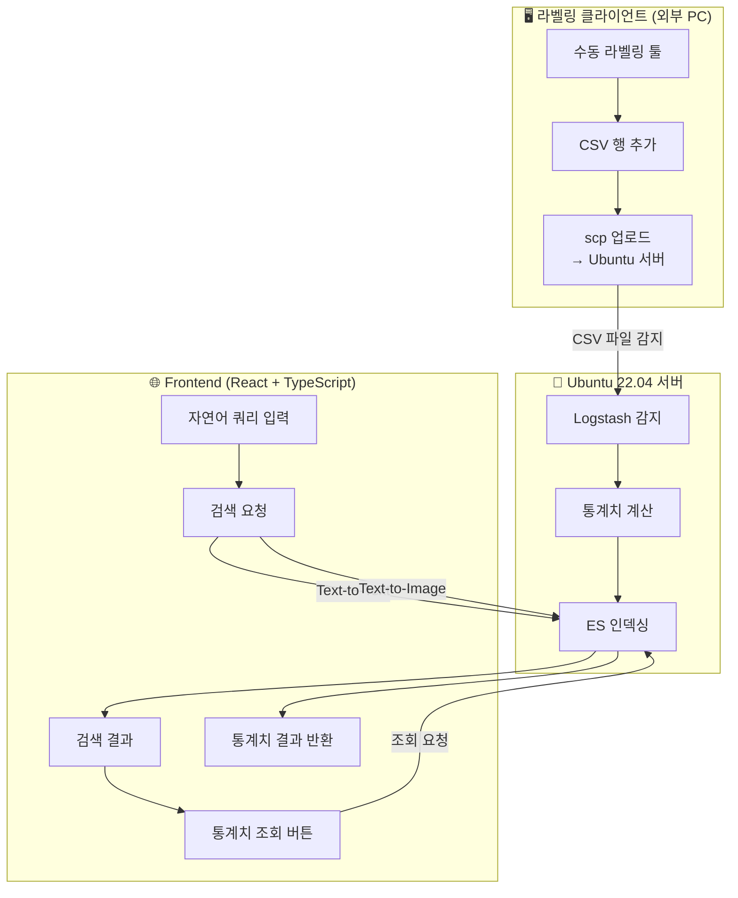

# 🤖 Multimodal Robot Data Search Agent

## 📌 프로젝트 개요
이 프로젝트는 **DROID Dataset 1.0.1**을 기반으로 시작되었습니다.  
처음에는 로봇 시퀀스 데이터를 분석하고, 머신러닝/딥러닝 모델을 적용하여 동작 분류를 시도했으나  
**라벨 경계가 애매하고 데이터 특성이 불분명**하여 모델링 성능에 한계를 경험했습니다.  

이에 따라 단순 분류 모델링을 넘어,  
👉 **대량의 로봇 센서 데이터와 영상을 멀티모달하게 검색할 수 있는 Agent Tool**을 개발하게 되었습니다.  

---

## 🎯 문제 정의
- 로봇 연구자가 직면하는 가장 큰 어려움 중 하나는  
  **“방대한 데이터에서 특정 동작이나 시퀀스를 빠르게 찾아내는 것”** 입니다.  

- DROID와 같은 대규모 로봇 데이터셋은 수천~수만 개의 시퀀스와 영상으로 이루어져 있어,  
  사람이 직접 탐색하기에는 **매우 비효율적이고 반복적**입니다.  
  
- 또한 로봇 동작의 품질을 개선하려면, **센서 로그에서 도출된 통계 정보**를 직관적으로 파악할 수 있어야 합니다.  
  이를 통해 엔지니어는 문제의 원인을 **하드웨어(HW) 또는 소프트웨어(SW)** 관점에서 신속하게 찾을 수 있습니다.  
  

- 더 나아가, 제조업 강국인 대한민국은 **인구 절벽 문제**로 인해 노동력 부족 현상이 심화되고 있으며,  
  이에 따라 로봇의 일자리 대체는 **불가피한 흐름**이 되고 있습니다.  

- 따라서, **AI 기반 자동화의 품질 개선과 문제 포착을 손쉽게 지원하는 에이전트 툴**이 필요하다고 판단했습니다.  

---

## 🔍 데이터 분석 과정

- **초기 접근**
  - 원본 DROID Dataset 1.0.1은 로봇 시퀀스, 영상, 센서 로그(관절/카르테시안 좌표 (데카르트 좌표계를 따름)로 구성되어 있습니다.
  - 연구소 별로 샘플을 뽑아본 결과 각기 다른 컬럼의 수, 품질의 차이 (최소 프레임,센서데이터 nan값 유무,메타데이터 설명 부실 등)의 문제를 해결하기위해
    연구소의 선정도 필요했고, **고정된 스키마**가 요구 되었습니다.
  - 동작 라벨(ground truth)이 명확하지 않아, **행동 단위 라벨을 생성**할 필요가 있다고 판단했습니다.

- **요인분석 (Factor Analysis) 수행**
  - 센서 데이터의 고차원 변수를 줄이고 행동을 설명하는 잠재 요인을 찾고 고정된 스키마를 수립하기위해 요인분석을 실시했습니다.  
  - Bartlett 구형성 검정 및 KMO 측도를 사용하여 요인분석 적합성을 검증  
    

  - Bartlett 검정: 유의확률 p < 0.001 → 변수들 간 상관관계가 유의미함  
  - KMO overall = 0.632 → **요인분석이 가능하지만 다소 경계선 수준**
  - - → 변수 간 상관성이 매우 강하여 공분산 행렬이 수치적으로 불안정하게 계산되었습니다. 
  - 하지만 p-value가 유의하므로, 요인분석 자체는 적용 가능하다고 판단  
  - 이 결과를 기반으로, 센서 데이터에서 주요 행동 요인을 도출하고
    공선성이 강한 변수들을 제거하는 절차를 진행했습니다.
 

- **라벨 생성 (`desc_major`)**
  - 요인분석 및 센서 패턴 분석을 종합하여 직접 라벨링을 수행하기 위한 **라벨링 툴**을 제작했습니다.
     - 

  - `"대기"`, `"파지"`, `"운반"`, `"내려놓기"`, `"정렬"`, `"이탈"`, `"완료"` 등 주요 행동 단위로 구분  
  - → 최종적으로 데이터셋에 **`desc_major` 컬럼**을 생성  

- **시각화 검증**
  -  라벨링한 결과를 토대로 Cartesian Position/Velocity 그래프에 `desc_major` 경계를 표시하여 비교  
  - 실제 센서 패턴은 연속적이고 선형적인 경우도 있는데 , 라벨은 특정 시점에서 뚝 끊겨 바뀌는 경우 다수 발견, 동작별 일관된 패턴 거의 포착불가, 즉 **경계가 애매하다** 라는 결론에 도달했습니다.
  - → 이로 인해 분류 모델은 성능이 제한적일 수 있음을 예상했습니다 아래는 좌표계의 변화에 따른 라벨의 변화 입니다.
      

---

---

## 🧪 시도한 접근 & 결과

---

### ⚠️ 한계/실패한 시도

#### 1
🤖**머신러닝 기반 센서 시퀀스 분류 (오토라벨링) 모델 제작**
  - `XGBoost`
  - **적용 이유**:
    - 센서 로그를 구간 단위로 집계하면 시계열성이 약화되므로, 트리 기반 모델이 적합하다고 판단
    - 클래스 불균형에도 비교적 강건하고, 과적합 방지를 위한 정규화 기능이 탑재
    - 무엇보다 **Feature Importance**를 제공하여, 고차원 센서 피처 중 유효한 변수를 선별할 수 있음
  - **시도**: 센서 시퀀스를 구간 단위(feature 집계)로 변환 후 분류 학습
  - **결과**: 일정 수준의 성능은 보였으나,
    - **라벨 경계가 애매**하여 안정적 정확도 확보 실패
    - XGBoost는 비교적 나은 성능을 보였지만 여전히 분류 한계 존재
  - **인사이트**: 센서 데이터만으로는 “동작 전환 경계” 포착의 한계  
    - 학습한 도메인 내에서는 성능이 괜찮았지만, 다른 도메인으로 일반화하면 동작을 구분 X
  - **추가 성과** : **Feature Importance 분석**을 통해 수많은 센서 컬럼 중 유효한 특성을 선별할 수 있었음 → **이후 검색/탐색 설계에 참고됨**
#### 2
🤖**딥러닝 기반 센서 시퀀스 분류**
  - `SensorLSTMAttnClassifier` (LSTM + Attention Pooling)
  - **적용 이유**:
    - 센서 데이터는 본질적으로 시계열(Time-series) 특성을 가지므로, 순차적 패턴 학습이 필요
    - LSTM은 시계열 데이터의 시간적 의존성을 학습하는 데 강점이 있음
    - Attention Pooling을 추가하여, 시퀀스 내 중요한 타임스텝에 가중치를 주어 행동 구분 성능을 높이고자 함
  - **시도**: 시퀀스 전체를 입력받아 Attention 기반 요약 후 `desc_major` 라벨 분류
  - **강화**: 센서 수치형 컬럼에 jitter값을 추가해 약간의 노이즈를 0.01 부여했음, 이로인해 경계가 좀 더 뚜렷하게 보이기를 기대함
  - **결과**: 구조적으로는 정상 작동했으나
    - **라벨 경계 불명확성**으로 학습 안정성이 낮음
    - **클래스 불균형**으로 특정 라벨에 치우친 결과 발생
    - 장기 시퀀스 일반화 부족 (다른 도메인 데이터로 확장 시 성능 급격히 저하)
  - **인사이트**:
    - 단순 분류 모델로는 센서 데이터의 한계를 극복하기 어려움
    - 현재 센서 데이터는 분류보다는 **검색/탐색 기반 활용**이 더 적합하다는 결론
 #### 📉 센서 기반 분류 결과
   xgboost 와 LSTM Attention 모델을 적용했으나, 라벨 경계 문제와 클래스 불균형으로 인해 성능이 제한적이었습니다.
   
   
   
   
   
   
   
   
   - 일부 클래스(F1 ≈ 0.7)는 양호했지만, `"정렬"`과 같은 라벨은 F1 ≈ 0.2 수준  
   - 전체 accuracy ≈ 0.50 → **실제 적용하기에는 부족**
   - 두 모델의 차이가 크지않았기에 사진 1장으로 설명합니다.
   - ➡️ 분류보다는 검색 접근이 더 적합함을 확인  
#### 3
🤖**Gemma3를 이용한 비디오 캡셔닝 및 임베딩**
  - 모델: **Gemma3n (4B pt)**  
  - **적용 이유**:
    - 수동 라벨링 기반 접근의 성능이 만족스럽지 않았음
    - 따라서 **멀티모달 LLM인 Gemma3**를 활용하여,
      - 비디오를 프레임 단위로 나누어 캡셔닝(Text 생성)
      - 생성된 텍스트를 임베딩 모델에 전달하여 검색에 활용
    - Gemma3는 이미지 입력과 다국어 처리(한국어 포함)를 지원한다는 점에서 적합하다고 판단  
      
  - **시도**:
    - Hugging Face를 통해 로컬 환경에 모델을 탑재
    - 비디오 → 프레임 이미지 분할 → Gemma3를 이용한 캡션 생성 → 텍스트 임베딩 추출 파이프라인 구현 시도
  - **결과**:
    - 내부 자원(GPU 메모리) 부족으로 실행 4~5분 후 시스템 프리징 현상 발생
    - → 로컬 환경에서는 실험 불가
  - **인사이트**:
    - **가용 자원에 맞는 모델 선택**의 중요성을 확인
    - 추후 확장성을 고려한다면, 경량화 모델 또는 클라우드/분산 환경에서의 학습·추론이 필요
      - **추후 확장가능성&& 개선 가능 방향**
         - **Instruction Tuning (인스트럭션 튜닝)**
           - 현재 Gemma3는 기본 이미지/텍스트 멀티모달 처리에 강점이 있음
           - 추후 LoRA 기반 경량 튜닝을 통해, 
             - 비디오 프레임 → 캡션 생성 품질을 향상시키고
             - 한국어 기반 질의응답/검색 품질도 개선할 예정
         
         - **Quantization (양자화)**
           - 로컬 환경에서 실행 시 GPU/메모리 자원 한계로 문제가 발생했음
           - 4bit / 8bit 양자화를 적용하여 메모리 사용량을 줄이고,
             - 경량화된 모델 실행
             - 추론 안정성 확보
           - 이를 통해 프리징/리부팅 문제를 해결하고, 실험 반복성을 보장할 수 있을 것이라 예측
         
         - **멀티모달 통합 강화**
           - 센서 데이터 + 영상 + 텍스트를 동시에 활용하는 구조 확립
           - 검색뿐 아니라 **설명 가능한 로봇 동작 분석**까지 지원하는 방향으로 확장
 #### 4
🤖 **딥러닝 기반 비디오 행동 분류 (VideoMAE Fine-tuning)**
  - `VideoMAE (MCG-NJU/videomae-base)` 파인튜닝
  - **적용 이유**:
    - 로봇 영상 데이터는 본질적으로 **시퀀스(Sequence)** 특성을 가지므로, 프레임 단위가 아닌 **클립 단위(16프레임)** 학습이 필요
    - VideoMAE는 사전학습(Pretrained)된 강력한 비디오 표현 학습 모델로, 소규모 데이터셋에서도 **전이학습(Transfer Learning)** 이 가능
    - 프레임 기반 분류보다 **Temporal Dependency(시간적 의존성)** 를 잘 포착할 수 있음
  - **시도**:  
    - 사전학습된 VideoMAE를 가져와 6개 `desc_major` 클래스(대기/접근/파지/운반/들기/내려놓기)로 분류
    - 약 1000개 영상을 랜덤으로 가져와 8:2 비율로 학습하려했으나 인터프리터의 강제종료 문제 발생
      따라서 100개 영상을 학습용, 20개 영상을 테스트용으로 사용
    - 16 프레임 클립 단위로 잘라 학습 및 예측
  - **강화**:  
    - **멀티비디오 데이터셋 구조** 설계 (여러 영상+CSV 매핑 → 통합 학습 가능)
    - 중앙 프레임 라벨 기준으로 클립 단위 라벨링  
    - `AdamW + CrossEntropyLoss`, 학습률 1e-4 적용
  - **결과**:  
    - 학습 Loss는 안정적으로 수렴 (0.2 이하)  
    - 그러나 **테스트 정확도는 37.5~50% 수준**에 머무름
    - 클래스 불균형 영향으로 특정 라벨에 치우침 (대기,이동)
  - **인사이트**:
    - 단순 VideoMAE 파인튜닝만으로는 일반화 성능에 한계 존재
    - 비디오의 이미지 벡터가 환경에 영향을 많이 받게 되는데 조도,물건의 시점에 따른 색상,해상도 등에 의해 같은 공간, 비슷한 작업임에도 전혀 다른 벡터를 가지게됨
      즉, 다른 도메인에 대한 추론이 거의 안됨
    - 
    - 

   

 

---

## 🚀 새로운 방향 
이 프로젝트는 **멀티모달 검색 에이전트**를 제공합니다.  

- **입력**: 텍스트, 키워드, 혹은 예시 영상/센서 구간  
- **검색 대상**: 로봇 센서 데이터 (Cartesian Position, Velocity, Joint State 등) + 동기화된 영상  
- **출력**: 쿼리와 가장 유사한 Top5 영상 + 해당 영상의 센서 데이터 통계 정보  

---

## ✨ 기대 효과
- 🔍 **효율적인 탐색**  
  방대한 로봇 데이터셋에서 원하는 동작을 빠르게 찾을 수 있음  
- 🎥 **멀티모달 검색**  
  텍스트 + 영상 + 센서 신호를 동시에 활용하여 검색 정밀도 향상  
- 🛠 **엔지니어링 생산성 향상**  
  반복적이고 시간이 많이 드는 데이터 탐색 과정을 자동화  
- 📈 **연구/실험 가속화**  
  모델 학습이나 분석에 필요한 데이터를 더 쉽게 수집 가능  

---

---
# 우선 멀티 모달의 검색성능을 비교하기위해 Text To Text 의 결과도 같이 보여주기로 결정했습니다.

## 💻 개발 환경

- **OS**: Ubuntu 22.04 LTS  
- **Language**: Python 3.10 / TypeScript (React)  
- **Frameworks**: FastAPI, Node.js 18+  
- **TextEMB/ImageEMB**: Distil_multi + KoE5 (Text emb)  , sigrip ( Image + Text emb)
- **Database / Storage**: Elasticsearch 8.x  
- **Data Pipeline**: Logstash (ETL 기반 인제스천)  
- **Version Control**: GitHub  

> ⚙️ 모든 실험과 개발은 Ubuntu 22.04 LTS 환경에서 수행되었습니다.

---

# 텍스트투텍스트 임베딩 모델 선정 
---
## 📊 모델 벤치마크 결과

멀티모달 검색 시스템에 적용 가능한 다양한 임베딩 모델을 벤치마크했습니다.  
평가 지표는 **평균 실행 속도 / 처리량(Throughput) / 문장 간 유사도 점수**입니다.  

---

### 📝 실험에 사용된 문장
1. `"로봇이 블록을 파지한다."`  
2. `"로봇이 대상을 집는다."`  
3. `"오늘은 날씨가 맑다."`  

- **문장(1,2)** → 의미가 유사한 쌍 (동일 동작을 다른 표현으로 기술)  
- **문장(1,3)** → 의미가 전혀 다른 쌍 (로봇 동작 vs 날씨 서술)  

좋은 임베딩 모델이라면,  
- `Sim(1,2)` 값은 **높아야 함** → 유사 문장을 잘 묶어야 함  
- `Sim(1,3)` 값은 **낮아야 함** → 무관 문장은 잘 구분해야 함  

---

### 📌 결과 테이블

| Model                     | 평균 실행속도 (s) | Throughput (sent/s) | 문장(1,2) | 문장(1,3) |
|----------------------------|------------------:|--------------------:|----------:|----------:|
| e5-base                   | 0.0125            | 400.63              | 0.909     | 0.800     |
| e5-large                  | 0.0680            | 73.55               | 0.906     | 0.820     |
| **KoE5**                  | 0.0322            | 155.09              | 0.536     | 0.052     |
| MiniLM                    | 0.0103            | 487.78              | 0.767     | -0.087    |
| all-MiniLM-L6-v2          | 0.0108            | 464.90              | 0.782     | 0.619     |
| bge-small-en              | 0.0330            | 151.29              | 0.944     | 0.925     |
| bge-base-en               | 0.0507            | 98.60               | 0.928     | 0.899     |
| bge-large-en              | 0.0398            | 125.78              | 0.906     | 0.902     |
| bge-m3                    | 0.0205            | 243.53              | 0.805     | 0.562     |
| **distiluse-multilingual**| 0.0177            | 282.67              | 0.801     | 0.081     |
| xlm-r-distilroberta       | 0.0669            | 74.71               | 0.637     | 0.134     |
| all-mpnet-base-v2         | 0.0458            | 109.06              | 0.882     | 0.866     |
| multi-qa-mpnet-base-dot-v1| 0.0280            | 178.69              | 0.924     | 0.845     |
| ko-sroberta-multitask     | 0.0434            | 115.22              | 0.525     | -0.004    |

---

### 🔎 모델별 상세 해석

- **KoE5 (nlpai-lab/KoE5)**  
  - (1,2)=0.536 → 유사 문장은 낮게 평가  
  - (1,3)=0.052 → 무관 문장은 잘 구분  
  - 단순 semantic similarity 점수는 낮지만, 이는 KoE5가 **한국어 문서 검색(retrieval)** 태스크를 중심으로 학습되었기 때문  
  - E5 계열 특유의 `query:` / `passage:` 프리픽스 구조로 학습되어, 실제 검색 상황(“이 쿼리에 맞는 문서 찾아줘”)에서는 뛰어난 성능을 보임  
  - 따라서 KoE5는 **단독 유사도 계산용 모델이 아니라, 한국어 검색 환경에서 정밀한 매칭(Precision)**을 담당하기 적합  

- **distiluse-multilingual**  
  - (1,2)=0.801 → 유사 문장을 적절히 평가  
  - (1,3)=0.081 → 무관 문장도 잘 구분  
  - 평균 실행속도 0.0177s, Throughput 282 sent/s → **매우 빠른 처리 속도**  
  - 다국어 지원이 가능해 한국어와 영어가 혼재된 로봇 데이터셋에서도 안정적  
  - 따라서 대규모 데이터셋에서 **빠른 1차 검색(Recall 확보)** 단계에 최적  

- **E5 / BGE 계열**  
  - (1,2)=0.9 이상으로 유사 문장을 잘 묶음  
  - 하지만 (1,3)도 0.8~0.9로 높게 평가 → **비관련 문장까지 과도하게 유사하다고 인식**  
  - 즉, semantic similarity 점수 자체는 높지만, 실제 검색에서는 false positive가 늘어날 수 있음  

- **MiniLM, ko-sroberta 등**  
  - MiniLM은 매우 빠르지만, (1,3)=-0.087처럼 안정적이지 못한 결과  
  - ko-sroberta는 한국어 특화지만 유사도 점수가 낮아 검색 태스크에 불리  

---

### ✅ 최종 채택 전략

- **1차 검색 (Recall 단계)**: `distiluse-multilingual`  
  - 빠른 속도 + 다국어 지원  
  - 방대한 로봇 데이터에서 후보군(Top-N)을 빠르게 추출  

- **2차 정밀 평가 (Precision 단계)**: `KoE5`  
  - 한국어 전용 retrieval 모델  
  - 후보군을 정밀하게 매칭하여 최종 검색 품질 개선  

➡️ 최종적으로 **distiluse-multilingual + KoE5** 조합을 채택,  
**Recall(포괄성)**과 **Precision(정밀성)**을 동시에 달성할 수 있음을 확인했습니다.  

----------------------------------------------------------------------------------------------------------------------------------------------------------------------------------------
# 텍스트 + 이미지 임베딩 모델 선정

   ## 📊 텍스트 + 이미지 임베딩 실험 결과
   
   로봇 데이터는 영상(프레임)과 요약 텍스트가 함께 제공됩니다.  
   따라서 **텍스트–이미지 임베딩 모델**을 이용해  
   "자연어 → 장면 검색"이 가능한지 실험했습니다.  
   
   ---
   
   ### 📈 R@1 (정답을 1등으로 맞추는 비율)
   
   
   
   - **CLIP B/32**: R@1 ≈ 0.40 → 기본적인 검색은 가능하나 성능이 낮음  
   - **CLIP B/32 (Multilingual)**: R@1 ≈ 0.58 → 한국어 쿼리 대응으로 성능이 크게 개선됨  
   - **SigLIP so400m**: R@1 ≈ 0.60 → 멀티랭 CLIP보다 근소하게 높고, 특히 **랭킹 안정성**이 강점  
   
   ---
   
   ### 🔎 해석
   - CLIP은 영어 데이터셋 학습 기반이라 한국어 검색 시 성능 저하가 심함  
   - 멀티랭 CLIP은 한국어 쿼리에 잘 대응하지만, 프레임 수가 늘어나면 랭킹 품질이 흔들릴 수 있음  
   - SigLIP은 한국어 정렬에서 큰 이득은 없지만,  
     **멀티프레임 평균에도 안정적이고, 코사인 공간에서 일관된 검색 성능**을 보여줌  
   
   ---
   
   ### ✅ 결론
   - **CLIP**: baseline, 영어 중심  
   - **멀티랭 CLIP**: 한국어 검색 성능 개선  
   - **SigLIP**: 한국어 검색 + 프레임 확장 안정성 → 최종 채택  
   
   👉 즉, 우리 파이프라인에서는 **자연어 하나로 영상 검색이 가능한 구조**를 SigLIP을 통해 확보했습니다.
  

----------------------------------------------------------------------------------------------------------------------------------------------------------------------------------------

# 🏗️ 워크플로우 

-------------------------------------------------------------------------------------------------------------------------------------------------------------------------------------------------------------
# 시연 영상
## 검색 기능(실제 확인 결과 텍스트투텍스트가 압도적으로 성능이 좋지만 텍스트투이미지도 이에 부족하지않게 공통 영상을 찾아내는 모습)
[스크린캐스트 2025년 08월 25일 17시 59분 28초 (1).webm](https://github.com/user-attachments/assets/62e3b474-b5a8-4924-9b6a-7a76ae1e4fcd)

## 통계 기능(도메인 지식의 부족으로 정확하게 도움이 되는 통계치가 아닐수 있음 간단히 변경 가능)
[스크린캐스트 2025년 08월 25일 19시 00분 09초.webm](https://github.com/user-attachments/assets/d872a564-fa68-4fdd-bdf9-d153e12bc063)

---------------------------------------------------------------------------------------------------------------------------------------------------------------------------------------------------------------
## 📌 결론
이 프로젝트는 **"로봇 동작의 추론 , 동작 구간 색출 "**에서 출발했지만  
결국에는 **대량의 로봇 데이터와 영상에서 원하는 행동을 빠르게 찾는 검색 Agent**로 발전했습니다.  

# 📚 아쉬웠던 점 & 배운 점

### 😅 아쉬웠던 점
- **라벨 경계 애매성**  
  - 센서 로그 기반 분류 모델(XGBoost, LSTM+Attention) 모두 라벨 모호성 때문에 안정적 성능 확보가 어려웠습니다.
- **리소스 한계**  
  - Gemma3 같은 대형 모델을 로컬에서 돌리려다 자원 부족으로 중도 중단
- **데이터 스케일링의 어려움**  
  - DROID 데이터셋이 방대하다 보니, 전처리·라벨링 자동화의 필요성을 절실히 느꼇습니다.
- **도메인 지식의 부족**
  - 페이퍼에는 각 필드가 뭘 뜻하는지 설명을 해주고 있지만 실제 데이터는 그보다 더 다양한 컬럼이 존재했고 실제로 action과 observation 루트를 어떻게 해석해야할지부터
    제대로 알고 있지 않았습니다, 새로 접하게된 바이너리 구조의 파일 형식의 이해,각 필드 쌍의 시각적 이미지를 통한 이해를 통해 도메인의 어렴풋한 추론 덕에 분석하는 과정에서
    혼란이 있었습니다.

 
---

### 💡 배운 점
- **분류보다 검색**  
  - 센서 데이터는 “분류 정확도”보다는 **검색/탐색 방식**으로 활용하는 게 훨씬 실용적임을 깨달았습니다.
- **멀티모달 임베딩의 힘**  
  - SigLIP을 통해 텍스트 ↔ 이미지 검색을 안정적으로 구현 → **자연어 하나로 비정형 데이터를 탐색 가능**  , 멀티모달의 잠재력을 직접적으로 느끼게 되었습니다.
- **데이터 파이프라인 자동화의 중요성**  
  - Logstash → Elasticsearch 적재 → Frontend 검색까지 연결하면서, **E2E 파이프라인 설계의 가치**를 체득했습니다.
- **도메인 관점에서의 사고력**
  - 생소한 도메인에서 어떤식으로 문제를 해결해 나갈수 있을지 사고하는 능력을 기를수 있었고, 앞으로 접하게될 다양한 **도메인 지식에 대한 중요성**을
    배울수 있었습니다.
- **확장 가능성**  
  - 향후 센서 로그까지 임베딩/검색에 포함시킨다면, 엔지니어링 생산성을 더 높일 수 있는 가능성을 확인했습니다.
- **데이터셋의 가공 과정, 고차원 데이터의 분석 접근 방법**
   - 실제로 컬럼이 300개 이상인 데이터셋의 접근 방법과, 어떤식으로 차원을 줄여 모델 복잡도를 줄일지 구체적으로 계획을 수립해볼수 있었습니다.
   - **심층 분석을 하는 과정에서 분석기법의 다양성을  배웠습니다.**
